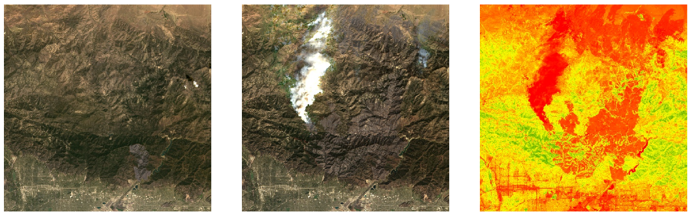

# Week 10: Remote Sensing

## Agenda

- [DH140 Git Puller](https://jupyter.idre.ucla.edu/hub/user-redirect/git-pull?repo=https%3A%2F%2Fgithub.com%2Fyohman%2F21W-DH140&urlpath=tree%2F21W-DH140%2F&branch=master)
- A conversation with Albert and Ben
- A 311 Remembrance
- --break--
- Story maps guide
- Lab 1: Remote Sensing

# Final project guidelines review

- Final presentation will begin at **2pm on March 17**
- Every group will present for no more than **8 minutes**
- Allow each group member roughly equal time to speak
- Groups will typically choose to present their storymap (if you choose to present in different format, let me know)
- All materials are to be submitted no later than 2pm on Wednesday of Finals Week (March 17)
   - A link to your story map (make sure to make it public)
   - Link(s) to your Jupyter Notebooks on github
   - Link(s) to your Jupyter Notebook(s) on Jupyter Hub
- [Final project guidelines](../../Midterm%20and%20Finals/readme.md)
