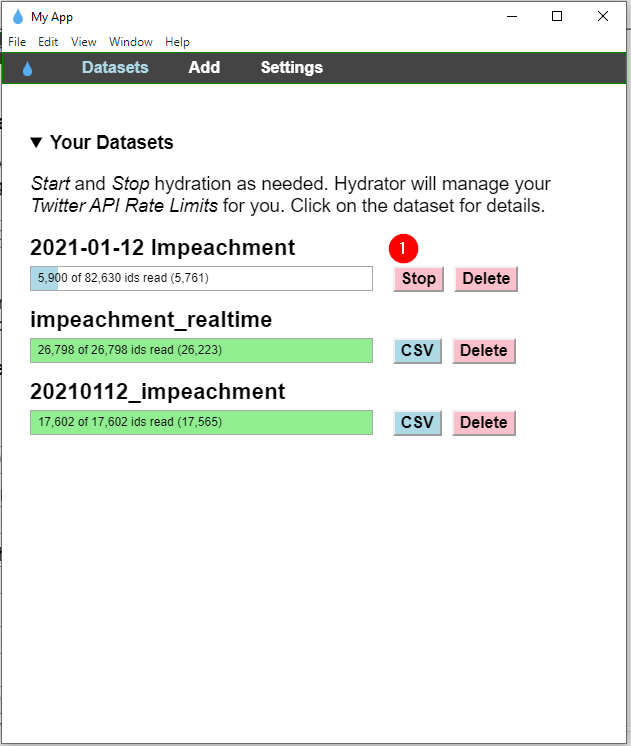

# Harvesting twitter

## 1. Install twarc

Follow directions here: https://scholarslab.github.io/learn-twarc/01-quick-start.html

## 2. Install the utilities folder

https://scholarslab.github.io/learn-twarc/07-twarc-utilities.html#get-the-utilities-from-github

## 2. Start the harvesting

https://scholarslab.github.io/learn-twarc/06-twarc-command-basics

You will use either `search` to archive past tweets up to the last 7 days:

`twarc search impeachment > tweets_search.jsonl`

or `filter` to collect tweets in realtime:

`twarc filter impeachment > tweets_filter.jsonl`

## 3. Get rid of retweets

`python utils/noretweets.py tweets.jsonl > tweets_noretweets.jsonl`

## 4. Dehydrate the tweets

Convert all your tweets to just their IDs:

`twarc dehydrate tweets_noretweets.jsonl > tweet_ids.txt`

## 5. Install the "hydrator"

What is the hydrator? https://github.com/DocNow/hydrator

Install from here:
https://github.com/DocNow/hydrator/releases

## 6. Hydrate the tweets

Launch the hydrator app, and add your dehydrated tweet_ids text file:
<kbd></kbd>

Start the hydration (it may ask you to name the output file. Make sure to give it a .csv extension):
<kbd></kbd>

Once you are done, click on the csv button again, to save the file (again).

